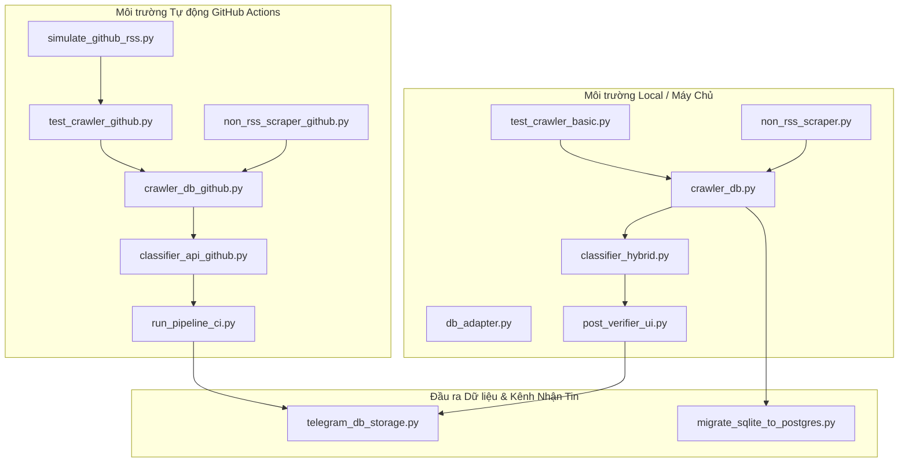
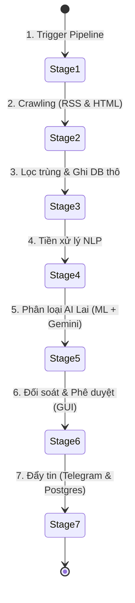
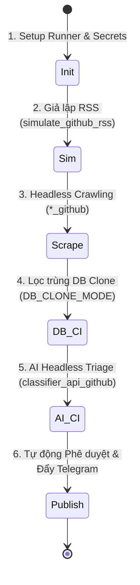

# 🗃️ VKS_BOT Knowledge Base & Documentation Hub

Chào mừng bạn đến với **Thư mục Tài liệu & Tri thức tham chiếu (`docs/`)** của dự án **VKS_BOT**. 

Đây là nơi lưu trữ tập trung tất cả các tài liệu kỹ thuật chuyên sâu, cẩm nang tra cứu bảo mật, nghiên cứu AI Agent và các cheat sheets hệ thống. Mục tiêu của thư mục này là hỗ trợ cả lập trình viên và các AI Agent (như Antigravity) tra cứu tức thời các giải pháp kỹ thuật tối ưu nhất trong quá trình phát triển và vận hành hệ thống.

---

## 📂 Danh sách các tài liệu trong thư mục

Hiện tại, thư mục tài liệu bao gồm các thành phần cốt lõi sau:

| Tên File | Vai trò chính | Nội dung chi tiết |
| :--- | :--- | :--- |
| [📜 **README.md**](file:///c:/Users/Admin/OneDrive/ACK/VKS_BOT/docs/README.md) | **Bản đồ Tri thức (Index)** | Giới thiệu tổng quan về thư mục, sơ đồ hoạt động và hướng dẫn tra cứu nhanh. |
| [📘 **book_of_secrets.md**](file:///c:/Users/Admin/OneDrive/ACK/VKS_BOT/docs/book_of_secrets.md) | **Bách khoa toàn thư DevOps & Security** | Kho lưu trữ 224k+ Stars trên GitHub chứa cẩm nang tra cứu CLI, câu lệnh một dòng (one-liners), cấu hình mạng và bypass WAF. |

---

## 🔍 Mô tả chi tiết tính năng & Vai trò của từng file

### 1. `README.md` (File này)
* **Vai trò:** Đóng vai trò là **"Cổng chỉ dẫn" (Gateway)** của thư mục tài liệu.
* **Tính năng:**
  * Giới thiệu tổng quan cấu trúc tài liệu.
  * Phân loại vai trò của từng tài liệu để lập trình viên và AI Agent định vị nhanh thông tin cần tìm.
  * Cung cấp các mẹo tìm kiếm nhanh để rút ngắn thời gian tra cứu.

---

### 2. `book_of_secrets.md` (Tên gốc: *The Book of Secret Knowledge*)
* **Vai trò:** **"Quyển bí kíp" hệ thống & bảo mật mạng**. Đây là kho tri thức thực chiến vô giá phục vụ cho việc quản trị server, mạng, bảo mật và tự động hóa.
* **Tính năng nổi bật:**
  * **CLI Tools (Công cụ dòng lệnh hiện đại):** Giới thiệu các công cụ dòng lệnh thế hệ mới tối ưu hóa hiệu suất làm việc (như `ripgrep` thay cho `grep`, `fd` thay cho `find`, `bat` thay cho `cat`).
  * **One-liners (Lệnh một dòng siêu đẳng):** Các đoạn mã Bash/Shell viết sẵn cực mạnh giúp lọc dữ liệu, phân tích tệp tin log khổng lồ, xử lý địa chỉ IP nhanh gọn.
  * **Security & WAF Bypassing (Vượt tường lửa):** Tổng hợp các thủ thuật, cấu hình HTTP header (`X-Forwarded-For`, `X-Real-IP`...) và phương pháp giả lập thông tin nhằm bypass tường lửa, chống lỗi chặn `403 Forbidden` từ các web server khó tính.
  * **Cheat Sheets (Bảng tra cứu nhanh):** Tra cứu nóng cú pháp cho Git, Docker, Kubernetes, Nginx, SQL, SSH, Regex... mà không cần phải Google tìm kiếm.

---

## 💡 Mẹo tra cứu nhanh dành cho Lập trình viên và AI Agent

### Dành cho Bạn (Trong VS Code / Cursor):
* Nhấn **`Ctrl + P`** rồi gõ `book_of_secrets.md` để mở nhanh file bí kíp.
* Nhấn **`Ctrl + F`** để tìm kiếm trực tiếp các từ khóa như `docker`, `nginx`, `git`, `ssh`, `waf` để lấy ngay câu lệnh mẫu.

### Dành cho AI Agent (Antigravity):
* Khi nhận được yêu cầu giải quyết lỗi hệ thống, cấu hình Nginx hoặc tối ưu Docker, AI Agent sẽ sử dụng công cụ `grep_search` quét trực tiếp file `docs/book_of_secrets.md` để đảm bảo đưa ra giải pháp chuẩn hóa, chính xác nhất mà không cần tạo yêu cầu HTTP tìm kiếm bên ngoài.

---

## 🏗️ Cấu trúc & Tính năng các file tại Thư mục Gốc (Root)

Để giúp lập trình viên và các AI Agent nắm bắt toàn diện kiến trúc mã nguồn của hệ thống **VKS_BOT**, dưới đây là sơ đồ phân loại kiến trúc và cẩm nang mô tả chi tiết tính năng của từng file mã nguồn nằm ở thư mục gốc:

### 1. Phân nhóm Kiến trúc Hệ thống

Dự án được thiết kế chuyên biệt và phân tách rõ ràng thành hai môi trường vận hành độc lập: **Local / Máy chủ Vận hành** (hỗ trợ đầy đủ UI quản trị và CSDL SQLite/PostgreSQL) và **GitHub Actions CI/CD** (chạy tự động, headless và mô phỏng trên cloud runner).

---

### 2. Cẩm nang mô tả tính năng chi tiết từng File

#### 🗄️ Tầng Dữ Liệu Vận Hành & Khớp Nối (Database Layer)
*   [db_adapter.py](file:///c:/Users/Admin/OneDrive/ACK/VKS_BOT/db_adapter.py)
    *   **Tính năng:** Lớp chuyển mạch cơ sở dữ liệu (Database Adapter) động.
    *   **Chi tiết:** Tự động nhận diện môi trường qua biến `DATABASE_URL` và `is_deployed` (hạ tầng Render hoặc GitHub Actions). Cung cấp các hàm trừu tượng để thống nhất cú pháp SQL giữa SQLite và PostgreSQL (ký tự placeholder `%s` vs `?`, hàm lấy thời gian `NOW()` vs `datetime('now')`, lỗi trùng khóa `psycopg2.errors.UniqueViolation` vs `sqlite3.IntegrityError`, câu lệnh chèn an sau lỗi trùng khóa `ON CONFLICT DO NOTHING` vs `INSERT OR IGNORE`).
*   [crawler_db.py](file:///c:/Users/Admin/OneDrive/ACK/VKS_BOT/crawler_db.py)
    *   **Tính năng:** Xương sống quản lý dữ liệu SQLite cục bộ (`crawler_data.db`).
    *   **Chi tiết:** Định nghĩa danh mục đồ sộ hơn **300+ kênh RSS chất lượng cao** của 26 tập đoàn báo chí lớn tại Việt Nam. Đồng thời lưu trữ cấu trúc bảng (`raw_articles`, `rss_sources`, `classified_articles`, `resolution_keywords`, `matched_cases`), nạp sẵn **200+ từ khóa pháp lý tiếng Việt chuyên sâu** phục vụ Nghị quyết 205/2025/QH15, và cung cấp bộ lọc trùng lặp bài viết (`filter_new_urls`).
*   [migrate_sqlite_to_postgres.py](file:///c:/Users/Admin/OneDrive/ACK/VKS_BOT/migrate_sqlite_to_postgres.py)
    *   **Tính năng:** Trình di chuyển dữ liệu thông minh và đồng bộ hóa lên Render Postgres Cloud.
    *   **Chi tiết:** Tích hợp các công nghệ di chuyển chuyên sâu bao gồm:
        *   *Quét & Tự động chọn tệp tin:* Tìm kiếm file `crawler_data.db` trên nhiều đường dẫn ứng viên và tự động chọn file có kích thước lớn nhất để đảm bảo lấy đúng dữ liệu thực tế.
        *   *Tối ưu hóa kết nối WAN:* Thiết lập TCP Keepalives và Connection Timeout (15s), giới hạn Statement Timeout (60s) tránh nghẽn luồng.
        *   *Đồng bộ cấu trúc gia tăng (Incremental Sync):* Dịch tự động schema SQLite sang Postgres (như thay `AUTOINCREMENT` thành `SERIAL PRIMARY KEY`), lược bỏ các ràng buộc `FOREIGN KEY` tạm thời để tránh nghẽn thứ tự chèn qua mạng WAN, và tự động quét bổ sung các cột còn thiếu trên Postgres Cloud (như cột `telegram_sent`).
        *   *Chèn Bulk Insert hiệu năng cao:* Sử dụng `psycopg2.extras.execute_values` với kích cỡ batch size = 200 giúp nạp dữ liệu siêu tốc.
        *   *Cứu hộ an toàn (SAVEPOINT Rescue):* Tự động làm sạch các ký tự NUL (`\x00`) gây lỗi trên Postgres. Nếu một khối dữ liệu bị lỗi kết nối hoặc trùng lặp, hệ thống sử dụng khối lệnh `SAVEPOINT row_save` / `ROLLBACK TO SAVEPOINT` / `RELEASE SAVEPOINT` để chuyển sang chèn từng dòng cứu hộ, giúp giữ lại tối đa các dòng hợp lệ mà không làm hỏng tiến trình đồng bộ.

#### 📡 Tầng Thu Thập Tin Tức Vận Hành (Crawlers & Scrapers)
*   [test_crawler_basic.py](file:///c:/Users/Admin/OneDrive/ACK/VKS_BOT/test_crawler_basic.py)
    *   **Tính năng:** Bộ thu thập tin tức RSS đa luồng hiệu năng cao cục bộ.
    *   **Chi tiết:**
        *   *Đa luồng song song:* Sử dụng `ThreadPoolExecutor` (lên đến 25 workers) để quét đồng thời các nguồn RSS.
        *   *Đồng bộ hóa ghi nhật ký:* Thay thế hàm `print` mặc định bằng `safe_print` sử dụng `threading.Lock` để tránh đè chữ, rối loạn log trên Console.
        *   *Hỗ trợ SSL lỗi thời:* Thiết lập bộ chuyển đổi `LegacySSLAdapter` kích hoạt cờ `SSL_OP_ALLOW_UNSAFE_LEGACY_RENEGOTIATION` của thư viện `urllib3` để truy cập thành công các cổng thông tin chính phủ có cấu hình TLS/SSL cũ.
        *   *XML Sanitizer & Cookie Bypass:* Tự động làm sạch dữ liệu XML lỗi (loại bỏ ký tự điều khiển ASCII, tự động escape ký tự `&` tự do), tự giải quyết thử thách Cookie đặc thù của Báo Lao Động (`D1N`), và tự động hoán đổi User-Agent thông minh (như dùng `facebookexternalhit/1.1` cho các trang dễ bị chặn 403 như Hà Nội Mới).
        *   *Trích xuất sâu NLP:* Gọi thư viện **`newspaper4k`** để tự động parse HTML chi tiết, bóc tách nội dung bài viết gốc sạch sẽ và tự động tóm tắt (summary) nội dung.
*   [non_rss_scraper.py](file:///c:/Users/Admin/OneDrive/ACK/VKS_BOT/non_rss_scraper.py)
    *   **Tính năng:** Trình cào dữ liệu HTML DOM trực tiếp (phi RSS).
    *   **Chi tiết:** Hướng tới các cổng thông tin, trang tin thanh tra, tài nguyên môi trường hoặc sở ngành Hà Nội không hỗ trợ RSS. Định nghĩa các bộ bóc tách chuyên biệt cho từng trang và đặc biệt tích hợp bộ lọc dự phòng thông minh **`smart_fallback_extractor`** (tự động phân tích các thẻ liên kết `<a>`, lọc bỏ menu điều hướng, trích xuất tiêu đề dài và thẻ đoạn văn lân cận để làm tóm tắt) giúp đảm bảo luôn lấy được dữ liệu ngay cả khi trang web đích thay đổi hoàn toàn cấu trúc giao diện.

#### 🧠 Tầng Trí Tuệ Nhân Tạo & Phân Loại Pháp Lý (AI & NLP Layer)
*   [classifier_hybrid.py](file:///c:/Users/Admin/OneDrive/ACK/VKS_BOT/classifier_hybrid.py)
    *   **Tính năng:** Bộ thẩm định và gán nhãn tin tức 12 lĩnh vực bảo vệ bằng AI.
    *   **Chi tiết:** Mặc dù giữ tên gọi lịch sử là "Hybrid", mã nguồn thực tế đã được nâng cấp chạy **100% Generative AI** để đạt độ chính xác tuyệt đối. Hệ thống gom các bài viết chưa xử lý thành từng chunk 50 bài và khởi chạy tối đa 12 luồng song song đẩy trực tiếp lên mô hình **Gemma 4 31B-it** (chính) và **Gemma 4 26B-it** (dự phòng) qua Gemini API.
*   [ml_preprocessor.py](file:///c:/Users/Admin/OneDrive/ACK/VKS_BOT/ml_preprocessor.py)
    *   **Tính năng:** Bộ tiền xử lý ngôn ngữ tự nhiên (NLP) cho tiếng Việt.
    *   **Chi tiết:** Chuẩn hóa Unicode, dọn dẹp các ký tự thừa, và hỗ trợ bóc tách từ ghép tiếng Việt (Word Segmentation) để làm sạch dữ liệu đầu vào.
*   `logistic_model.pkl` & `vectorizer.pkl`
    *   **Tính năng:** Các stubs lưu niệm của mô hình học máy cũ.
    *   **Chi tiết:** Đây là các tệp đóng băng (Pickle) của mô hình học máy truyền thống cũ (TF-IDF + Logistic Regression). Chúng hiện đã được chuyển thành các stubs trống (134 bytes) và **bị bỏ qua hoàn toàn** trong luồng xử lý hoạt động thực tế để nhường chỗ cho độ chính xác vượt trội của Generative AI.

#### 💻 Giao Diện Người Dùng & Phân Phối Tri Thức (UI & Distribution Layer)
*   [post_verifier_ui.py](file:///c:/Users/Admin/OneDrive/ACK/VKS_BOT/post_verifier_ui.py)
    *   **Tính năng:** Giao diện quản trị, đối soát và phê duyệt tin tức (PyQt Admin Dashboard).
    *   **Chi tiết:** Ứng dụng GUI đồ sộ viết bằng Python cung cấp màn hình trực quan cho phép người vận hành đối soát nhãn phân loại của AI, chỉnh sửa nội dung bài viết, thay đổi lĩnh vực bảo vệ và nhấn nút xuất bản (Approve).
*   [telegram_db_storage.py](file:///c:/Users/Admin/OneDrive/ACK/VKS_BOT/telegram_db_storage.py)
    *   **Tính năng:** Trình đồng bộ cơ sở dữ liệu SQLite qua Telegram & Đẩy báo cáo thống kê.
    *   **Chi tiết:** Thực hiện hai nhiệm vụ cốt lõi:
        1.  *Database over Telegram Storage (Đồng bộ đám mây SQLite miễn phí):* Cung cấp cơ chế tải lên (`upload_db`) ghim tự động cơ sở dữ liệu SQLite cục bộ lên kênh Telegram làm bản sao lưu và kéo về cơ sở dữ liệu SQLite mới nhất (`download_db`) từ tin nhắn đã ghim trong kênh. Đóng vai trò là hệ thống lưu trữ đồng bộ SQLite cloud không cần máy chủ trung gian!
        2.  *Notification Reporting:* Đóng gói tin bài đã được phê duyệt, định dạng Markdown trực quan và đẩy cảnh báo tức thời kèm bảng chi tiết số lượng vi phạm theo từng lĩnh vực bảo vệ về Telegram Bot API.

#### 🤖 Môi Trường Chạy Tự Động & Kiểm Thử (GitHub Actions CI/CD Layer)
Để hỗ trợ chạy tự động không người lái (headless) trên hạ tầng cloud của GitHub Actions, dự án tối ưu riêng các phiên bản `*_github.py` kết nối trực tiếp PostgreSQL đám mây:
*   [db_adapter_github.py](file:///c:/Users/Admin/OneDrive/ACK/VKS_BOT/db_adapter_github.py)
    *   **Tính năng:** Trình quản lý kết nối PostgreSQL chuyên sâu có khả năng tự động nhân bản (Table Cloning).
    *   **Chi tiết:**
        *   *Auto-Cloning Engine:* Khi biến môi trường `DB_CLONE_MODE="true"` được kích hoạt trên CI, lớp này sẽ tự động nhân bản cấu trúc toàn bộ các bảng gốc hiện có sang các bảng phụ có hậu tố `_clone` (ví dụ `raw_articles` -> `raw_articles_clone`) thông qua lệnh `CREATE TABLE ... (LIKE ... INCLUDING ALL)`. Hệ thống đồng thời đồng bộ dữ liệu ban đầu và định vị lại cấu trúc khóa ngoại chéo giữa các bảng clone.
        *   *Query Interceptor Wrapper:* Sử dụng các lớp bọc `CloneTableConnectionWrapper` và `CloneTableCursorWrapper` để đánh chặn thời gian thực tất cả các câu truy vấn SQL và tự động viết lại tên bảng gốc thành tên bảng clone. Cơ chế này giúp cách ly hoàn toàn dữ liệu thử nghiệm CI khỏi cơ sở dữ liệu sản xuất!
*   [crawler_db_github.py](file:///c:/Users/Admin/OneDrive/ACK/VKS_BOT/crawler_db_github.py)
    *   **Tính năng:** Lớp nghiệp vụ CSDL PostgreSQL đám mây tối giản.
    *   **Chi tiết:** Loại bỏ hoàn toàn sự phụ thuộc vào SQLite cục bộ, nạp sẵn danh sách 300+ nguồn RSS/Non-RSS chất lượng cao và 200+ từ khóa pháp lý, hỗ trợ đồng bộ ghi nhận bài viết hiệu năng cao bằng Bulk Insert trên PostgreSQL.
*   [test_crawler_github.py](file:///c:/Users/Admin/OneDrive/ACK/VKS_BOT/test_crawler_github.py)
    *   **Tính năng:** Script cào tin RSS tích hợp Proxy và Google Web Cache Bypass trên GitHub Actions.
    *   **Chi tiết:**
        *   *Selective Proxy Routing:* Tự động phát hiện biến cấu hình `VIETNAM_PROXY`. Đối với các trang tin tức nhà nước Việt Nam chặn dải IP Azure của GitHub Actions (như `hanoimoi.vn`, `kinhtemoitruong.vn`, `qdnd.vn`), hệ thống chủ động định tuyến các yêu cầu HTTP này đi qua proxy Việt Nam.
        *   *Google Web Cache Bypass:* Nếu cào trực tiếp qua proxy vẫn thất bại hoặc trả về mã lỗi không phải 200, hệ thống tự động chuyển hướng cào thông qua dịch vụ lưu trữ Google Web Cache (`https://webcache.googleusercontent.com/search?q=cache:<URL>`) giúp phục hồi kết nối thành công và vượt tường lửa WAF cực kỳ nhạy bén!
        *   *Newspaper4k Proxy Optimization:* Tải trước mã HTML của trang chi tiết bằng Session tích hợp proxy/cache, sau đó truyền trực tiếp dữ liệu HTML vào `Article.set_html()` của newspaper để trích xuất tóm tắt mà không để newspaper tự tải trang (tránh lỗi ngắt kết nối).
*   [non_rss_scraper_github.py](file:///c:/Users/Admin/OneDrive/ACK/VKS_BOT/non_rss_scraper_github.py)
    *   **Tính năng:** Script cào tin phi RSS tích hợp proxy, web cache và hàng chờ lịch sự (Polite Queue).
    *   **Chi tiết:** Tương tự như phiên bản cào RSS, script này hỗ trợ đầy đủ proxy Việt Nam và Google Web Cache bypass. Để tránh bị tường lửa Cloudflare chặn băng thông do cào dồn dập, script gom các nguồn cào theo tên miền (`process_domain_group`) và thực hiện cào tuần tự các trang trong nhóm kèm khoảng nghỉ ngẫu nhiên (1.5s - 3s).
*   [classifier_api_github.py](file:///c:/Users/Admin/OneDrive/ACK/VKS_BOT/classifier_api_github.py) (Được gọi bởi [classifier_hybrid_github.py](file:///c:/Users/Admin/OneDrive/ACK/VKS_BOT/classifier_hybrid_github.py))
    *   **Tính năng:** Trình thẩm duyệt tin tức AI thuần túy (Thuần AI) và dọn dẹp địa lý tự động trên Cloud.
    *   **Chi tiết:**
        *   *Robust JSON Parser:* Phản hồi từ mô hình Gemma thường có thể bị sai lệch cấu trúc JSON (thừa dấu phẩy, nháy đơn, boolean Python). Hàm `robust_json_loads` tích hợp regex để tự động loại bỏ ký tự markdown backticks, trích xuất mảng khớp `[...]`, sửa Booleans, loại bỏ dấu phẩy thừa trước ngoặc đóng và bóc tách các dictionary đơn lẻ bằng regex để cứu hộ JSON bị hỏng.
        *   *Location Sweep:* Tự động quét và loại bỏ các tin bài đã khớp vi phạm nhưng xảy ra ngoài địa bàn Hà Nội (`LOCATION_REJECTED`), cập nhật trạng thái `human_evaluation = 0` trực tiếp trong PostgreSQL để tự động ẩn các tin này khỏi danh sách chờ duyệt, đưa thẳng vào tab "Bị loại bỏ".
        *   *Báo cáo trực quan:* Xuất trực tiếp bảng phân tích thống kê số lượng bài viết vi phạm theo 12 lĩnh vực bảo vệ ngay trên bảng điều khiển Console của GitHub Actions.
*   [simulate_github_rss.py](file:///c:/Users/Admin/OneDrive/ACK/VKS_BOT/simulate_github_rss.py)
    *   **Tính năng:** Trình giả lập nguồn tin RSS chất lượng cao cho hoạt động Integration Test.
    *   **Chi tiết:** Tự động sinh ra cấu trúc XML/RSS giả lập giống hệt cấu trúc các trang báo lớn của Việt Nam, giúp kiểm thử toàn bộ luồng cào, lọc trùng và lưu DB trên GitHub Actions mà không lo rớt mạng.
*   [run_pipeline_ci.py](file:///c:/Users/Admin/OneDrive/ACK/VKS_BOT/run_pipeline_ci.py)
    *   **Tính năng:** Nhạc trưởng điều phối toàn bộ luồng tích hợp tự động trên GitHub Actions.
    *   **Chi tiết:** Liên kết và kích hoạt tuần tự 5 bước tự động hóa headless: Khởi tạo schema DB ➔ Cào RSS (test_crawler_github) ➔ Cào HTML phi RSS (non_rss_scraper_github) ➔ Thẩm duyệt AI (classifier_api_github) ➔ Tổng hợp số lượng bài mới, bài AI thẩm duyệt, bài vi phạm và gửi báo cáo Telegram Markdown cực kỳ chuyên nghiệp.
*   [.github/workflows/test_403_rss.yml](file:///c:/Users/Admin/OneDrive/ACK/VKS_BOT/.github/workflows/test_403_rss.yml)
    *   **Tính năng:** Workflow độc lập kiểm thử lỗi kết nối WAF 403 và thực nghiệm cơ chế Google Translate Proxy bypass.
    *   **Chi tiết:** Thực nghiệm 4 phương thức kết nối: Kết nối trực tiếp, Giả lập Headers, Google Web Cache và Google Translate Proxy cho 3 trang báo bị chặn (`qdnd.vn`, `kinhtemoitruong.vn`, `hanoimoi.vn`), tự động kết xuất báo cáo Markdown trực quan ra Job Step Summary.

---

## 🔄 Quy trình Hoạt động Từng bước của Hệ thống (Operational Workflow)

Hệ thống `VKS_BOT` vận hành theo một quy trình khép kín tự động hóa cao từ khâu thu thập dữ liệu thô cho tới khâu xuất bản tin tức đã qua phân loại AI. Quy trình chi tiết gồm 7 bước chính như sau:

### 🔹 Bước 1: Kích hoạt Luồng (Trigger Pipeline)
*   **Môi trường Local / Production:** Được điều phối thông qua script điều phối chính [run_pipeline_ci.py](file:///c:/Users/Admin/OneDrive/ACK/VKS_BOT/run_pipeline_ci.py) bằng tay hoặc thông qua scheduler chạy ngầm trên VPS.
*   **Môi trường GitHub Actions:** Tự động kích hoạt định kỳ qua file cấu hình `.github/workflows` gọi trực tiếp script điều phối [run_pipeline_ci.py](file:///c:/Users/Admin/OneDrive/ACK/VKS_BOT/run_pipeline_ci.py).

### 🔹 Bước 2: Thu thập Dữ liệu (Crawlers & Scrapers)
Hệ thống song song triển khai hai cơ chế cào tin:
1.  **Cào RSS ([test_crawler_basic.py](file:///c:/Users/Admin/OneDrive/ACK/VKS_BOT/test_crawler_basic.py) / [test_crawler_github.py](file:///c:/Users/Admin/OneDrive/ACK/VKS_BOT/test_crawler_github.py)):**
    *   Sử dụng thư viện `feedparser` để quét và bóc tách cấu trúc file XML từ hơn 300+ nguồn báo lớn.
    *   Tải trực tiếp bài viết chi tiết, tự động phân tích cấu trúc bài bằng **`newspaper4k`** để lấy nội dung bài viết sạch (clean text), tác giả, ngày đăng và tự động sinh bản tóm tắt (summary) sơ bộ.
    *   Tích hợp `LegacySSLAdapter` tự động sửa lỗi và chấp nhận chứng chỉ SSL cũ của các cơ quan nhà nước.
2.  **Cào HTML Trực tiếp ([non_rss_scraper.py](file:///c:/Users/Admin/OneDrive/ACK/VKS_BOT/non_rss_scraper.py) / [non_rss_scraper_github.py](file:///c:/Users/Admin/OneDrive/ACK/VKS_BOT/non_rss_scraper_github.py)):**
    *   Áp dụng cho các trang báo đặc thù không hỗ trợ RSS.
    *   Dùng các biểu thức DOM chuyên biệt kết hợp cơ chế tự động phục hồi `smart_fallback_extractor` để bóc nội dung bài viết một cách chính xác nhất khi cấu trúc trang tin thay đổi.

### 🔹 Bước 3: Lọc trùng & Lưu trữ dữ liệu thô (Deduplication & Storage)
*   Toàn bộ các URL bài viết cào về được chuyển qua đối tượng DB Adapter ([db_adapter.py](file:///c:/Users/Admin/OneDrive/ACK/VKS_BOT/db_adapter.py) hoặc [db_adapter_github.py](file:///c:/Users/Admin/OneDrive/ACK/VKS_BOT/db_adapter_github.py)).
*   Hệ thống gọi hàm `filter_new_urls` đối soát trực tiếp danh sách URL mới với cơ sở dữ liệu đã lưu trữ.
*   **Kết quả:** Loại bỏ hoàn toàn các tin bài đã cào trước đó, chỉ ghi nhận các bài viết mới chưa từng xuất hiện vào bảng dữ liệu thô của SQLite (`crawler_data.db`) để tối ưu hóa tài nguyên xử lý ở các bước sau.

### 🔹 Bước 4: Tiền xử lý Ngôn ngữ Tiếng Việt (NLP Preprocessing)
*   Nội dung bài viết thô (tiếng Việt) được chuyển vào bộ tiền xử lý [ml_preprocessor.py](file:///c:/Users/Admin/OneDrive/ACK/VKS_BOT/ml_preprocessor.py).
*   Thực hiện chuẩn hóa bảng mã Unicode (tránh lỗi font chữ từ các nguồn báo khác nhau).
*   Lọc bỏ các ký tự rác, thẻ HTML thừa và tiến hành **bóc tách từ ghép tiếng Việt (Word Segmentation)**. Bước này giúp nhóm các từ ghép tiếng Việt lại với nhau, chuẩn bị dữ liệu đầu vào tối ưu nhất cho mô hình phân loại học máy.

### 🔹 Bước 5: Phân loại Chủ đề bằng AI (AI Triage & Classification)
*   Toàn bộ bài viết thô chưa phân loại được chuyển thẳng đến bộ xử lý [classifier_hybrid.py](file:///c:/Users/Admin/OneDrive/ACK/VKS_BOT/classifier_hybrid.py) / [classifier_hybrid_github.py](file:///c:/Users/Admin/OneDrive/ACK/VKS_BOT/classifier_hybrid_github.py).
*   **100% Xử lý bằng Generative AI (Không dùng Machine Learning):**
    *   Theo yêu cầu kỹ thuật mới nhất, hệ thống **bỏ qua hoàn toàn** tầng Machine Learning truyền thống cục bộ (`logistic_model.pkl` và `vectorizer.pkl` chỉ còn là stubs lưu niệm) để đảm bảo độ chính xác tuyệt đối trong việc nhận diện 12 lĩnh vực bảo vệ của Nghị quyết 205.
    *   Bài viết được phân chia thành từng lô (chunk) tối ưu chứa tối đa 50 bài viết để tối ưu RPD (Requests Per Day).
    *   Hệ thống khởi chạy đa luồng cực mạnh (`ThreadPoolExecutor` tối đa 12 threads) để truyền song song các chunk lên Google Generative AI API.
*   **Mô hình & Cơ chế dự phòng (Fallback):**
    *   Sử dụng mô hình ngôn ngữ lớn **Gemma 4 31B-it** làm mô hình thẩm định chính.
    *   Nếu gặp lỗi kết nối hoặc nghẽn API, hệ thống tự động chuyển sang mô hình dự phòng **Gemma 4 26B-it** sau khoảng thời gian thử lại cố định từ 3s đến 4s để đảm bảo luồng cào không bao giờ bị gián đoạn.
    *   AI tiến hành thẩm duyệt sâu ngữ cảnh pháp lý, chấm điểm độ tin cậy (`confidence_score`), trích xuất lý do vi phạm (`match_reason`), xác minh địa bàn xảy ra có thuộc Hà Nội hay không (`is_hanoi`), và tự động loại bỏ các tin tức thuộc tỉnh thành khác.
*   Cập nhật danh mục phân loại chính thức và trạng thái kiểm duyệt trở lại Cơ sở dữ liệu.

### 🔹 Bước 6: Đối soát & Phê duyệt Thủ công (Verification & Manual Review)
*Bằng chứng vận hành thực tế tại môi trường Local/Production:*
*   Người vận hành dự án khởi động ứng dụng giao diện trực quan [post_verifier_ui.py](file:///c:/Users/Admin/OneDrive/ACK/VKS_BOT/post_verifier_ui.py).
*   Hệ thống hiển thị trực quan toàn bộ danh sách tin tức vừa cào kèm theo tag phân loại chủ đề do AI/ML gán.
*   Admin kiểm tra, chỉnh sửa nhanh tiêu đề/tóm tắt (nếu cần), thay đổi tag phân loại nếu AI gán nhầm và click nút **Phê duyệt (Approve)**.

### 🔹 Bước 7: Xuất bản & Phân phối Tin tức (Notification & Distribution)
*   Ngay sau khi tin bài được phê duyệt (hoặc tự động phê duyệt trên luồng CI không người lái), module [telegram_db_storage.py](file:///c:/Users/Admin/OneDrive/ACK/VKS_BOT/telegram_db_storage.py) sẽ đóng gói tin bài và đẩy trực tiếp lên kênh Telegram của ban biên tập/cơ quan.
*   Quản trị viên có thể chạy [migrate_sqlite_to_postgres.py](file:///c:/Users/Admin/OneDrive/ACK/VKS_BOT/migrate_sqlite_to_postgres.py) định kỳ để đồng bộ toàn bộ dữ liệu tin tức đã phê duyệt từ SQLite cục bộ lên máy chủ PostgreSQL phục vụ cho các ứng dụng web và hệ thống báo cáo bên ngoài.

---

## 🤖 Quy trình Hoạt động Tự động trên GitHub Actions (CI/CD Pipeline Workflow)

Để hệ thống hoạt động 24/7 hoàn toàn tự động và không phụ thuộc vào máy cá nhân, dự án cung cấp một pipeline chạy ẩn headless (không cần giao diện người dùng) trên môi trường ảo hóa của **GitHub Actions**. Quy trình chi tiết gồm 6 giai đoạn sau:

### 🔹 Bước 1: Khởi động & Nạp biến Môi trường (Runner Setup)
*   GitHub Actions runner (máy ảo Ubuntu/Windows trên cloud) được kích hoạt bởi cron-job (lên lịch sẵn) hoặc khi có commit mới.
*   Hệ thống tự động nạp các khóa bảo mật bảo mật từ **GitHub Secrets** vào biến môi trường:
    *   `GEMINI_API_KEY`: API Key để gọi mô hình AI.
    *   `TELEGRAM_BOT_TOKEN` & `TELEGRAM_CHAT_ID`: Thông tin xác thực để đẩy tin lên kênh Telegram.
    *   `DATABASE_URL`: Đường dẫn kết nối database PostgreSQL.

### 🔹 Bước 2: Giả lập nguồn RSS kiểm thử (Mock Simulation)
*   Hệ thống chạy script [simulate_github_rss.py](file:///c:/Users/Admin/OneDrive/ACK/VKS_BOT/simulate_github_rss.py) trước tiên trong quá trình chạy kiểm thử liên tục.
*   Script này sẽ tự động sinh ra các nguồn dữ liệu RSS giả lập có cấu trúc hoàn chỉnh để kiểm tra toàn bộ luồng cào và phân tích mà không cần kết nối thực tế ra internet, giúp phát hiện sớm các lỗi cú pháp trước khi chạy cào thật.

### 🔹 Bước 3: Cào tin tự động Headless (Headless Crawling)
*   Hệ thống gọi đồng thời [test_crawler_github.py](file:///c:/Users/Admin/OneDrive/ACK/VKS_BOT/test_crawler_github.py) and [non_rss_scraper_github.py](file:///c:/Users/Admin/OneDrive/ACK/VKS_BOT/non_rss_scraper_github.py).
*   Các file này hoạt động hoàn toàn ẩn nền, không sinh bất kỳ tương tác GUI nào, đồng thời xuất trực tiếp nhật ký vận hành (logs) ra màn hình điều khiển (Console) của GitHub Actions để dễ dàng giám sát từ xa.
*   Cấu hình giảm nhẹ tần suất request để tránh bị firewall của các trang báo Việt Nam chặn IP của GitHub Actions runner.

### 🔹 Bước 4: Lọc trùng & Ghi nhận DB Kiểm thử (Deduplication & Clone Mode)
*   Mã nguồn đi qua [db_adapter_github.py](file:///c:/Users/Admin/OneDrive/ACK/VKS_BOT/db_adapter_github.py) và [crawler_db_github.py](file:///c:/Users/Admin/OneDrive/ACK/VKS_BOT/crawler_db_github.py).
*   Nếu phát hiện biến môi trường `DB_CLONE_MODE="true"` (được kích hoạt trong môi trường kiểm thử CI), hệ thống tự động **chuyển hướng kết nối và thao tác SQL sang các bảng clone (`raw_articles_clone`, `classified_articles_clone`)**.
*   **Mục đích:** Đảm bảo toàn bộ luồng cào thử nghiệm trên GitHub Actions không bao giờ ghi đè hoặc làm hỏng cơ sở dữ liệu chính thống đang hoạt động trên môi trường sản xuất.

### 🔹 Bước 5: Phân loại tự động hoàn toàn bằng AI (Headless AI Triage)
*   Hệ thống kích hoạt [classifier_api_github.py](file:///c:/Users/Admin/OneDrive/ACK/VKS_BOT/classifier_api_github.py) để phân loại tin bài.
*   Module tự động nạp `GEMINI_API_KEY` từ bí mật môi trường và đẩy trực tiếp 100% dữ liệu bài viết mới lên các mô hình Generative AI của Google (**Gemma 4 31B-it** / **Gemma 4 26B-it**) để phân tích ngữ cảnh pháp lý và rà soát địa bàn Hà Nội.
*   Tự động bỏ qua các bài viết bị lỗi API mà không làm sập (crash) toàn bộ tiến trình CI.

### 🔹 Bước 6: Tự động Phê duyệt & Đẩy tin tức (Auto-Approval & Notification)
*   Do môi trường GitHub Actions chạy không người lái, bước đối soát thủ công bằng giao diện PyQt (`post_verifier_ui.py`) sẽ được **bỏ qua**.
*   Thay vào đó, hệ thống áp dụng cơ chế tự động phê duyệt:
    *   Các tin tức thuộc 12 lĩnh vực bảo vệ, có địa bàn xảy ra tại Hà Nội (`is_hanoi = true`) và điểm tin cậy đạt yêu cầu sẽ được tự động gắn nhãn phê duyệt xuất bản (`classification_status = 'AI_VERIFIED'`).
    *   Kịch bản điều phối [run_pipeline_ci.py](file:///c:/Users/Admin/OneDrive/ACK/VKS_BOT/run_pipeline_ci.py) lập tức gọi [telegram_db_storage.py](file:///c:/Users/Admin/OneDrive/ACK/VKS_BOT/telegram_db_storage.py) để đóng gói và gửi thông báo tin tức khẩn cấp tới Ban biên tập qua cổng Telegram Bot API.

---

*Thư mục này sẽ liên tục được cập nhật thêm các tài liệu nghiên cứu mới trong các phiên làm việc tiếp theo.*
